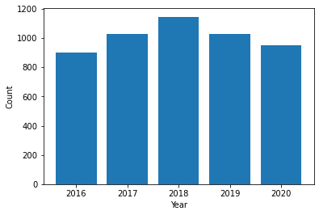
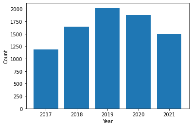
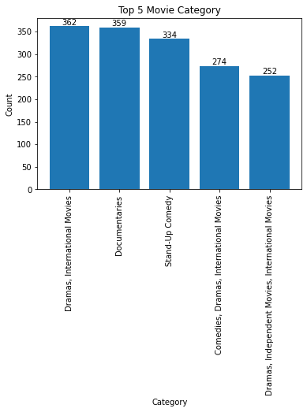
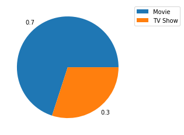

```python
import pandas as pd
import numpy as np
import matplotlib.pyplot as plt
import seaborn as sns

```


```python
data = pd.read_csv('https://raw.githubusercontent.com/kedeisha1/Challenges/main/netflix_titles.csv')

```


```python
# Checking the top 5 rows of data
data.head()
```


<div>
<style scoped>
    .dataframe tbody tr th:only-of-type {
        vertical-align: middle;
    }

    .dataframe tbody tr th {
        vertical-align: top;
    }

    .dataframe thead th {
        text-align: right;
    }
</style>
<table border="1" class="dataframe">
  <thead>
    <tr style="text-align: right;">
      <th></th>
      <th>show_id</th>
      <th>type</th>
      <th>title</th>
      <th>director</th>
      <th>cast</th>
      <th>country</th>
      <th>date_added</th>
      <th>release_year</th>
      <th>rating</th>
      <th>duration</th>
      <th>listed_in</th>
      <th>description</th>
    </tr>
  </thead>
  <tbody>
    <tr>
      <th>0</th>
      <td>s1</td>
      <td>Movie</td>
      <td>Dick Johnson Is Dead</td>
      <td>Kirsten Johnson</td>
      <td>NaN</td>
      <td>United States</td>
      <td>September 25, 2021</td>
      <td>2020</td>
      <td>PG-13</td>
      <td>90 min</td>
      <td>Documentaries</td>
      <td>As her father nears the end of his life, filmm...</td>
    </tr>
    <tr>
      <th>1</th>
      <td>s2</td>
      <td>TV Show</td>
      <td>Blood &amp; Water</td>
      <td>NaN</td>
      <td>Ama Qamata, Khosi Ngema, Gail Mabalane, Thaban...</td>
      <td>South Africa</td>
      <td>September 24, 2021</td>
      <td>2021</td>
      <td>TV-MA</td>
      <td>2 Seasons</td>
      <td>International TV Shows, TV Dramas, TV Mysteries</td>
      <td>After crossing paths at a party, a Cape Town t...</td>
    </tr>
    <tr>
      <th>2</th>
      <td>s3</td>
      <td>TV Show</td>
      <td>Ganglands</td>
      <td>Julien Leclercq</td>
      <td>Sami Bouajila, Tracy Gotoas, Samuel Jouy, Nabi...</td>
      <td>NaN</td>
      <td>September 24, 2021</td>
      <td>2021</td>
      <td>TV-MA</td>
      <td>1 Season</td>
      <td>Crime TV Shows, International TV Shows, TV Act...</td>
      <td>To protect his family from a powerful drug lor...</td>
    </tr>
    <tr>
      <th>3</th>
      <td>s4</td>
      <td>TV Show</td>
      <td>Jailbirds New Orleans</td>
      <td>NaN</td>
      <td>NaN</td>
      <td>NaN</td>
      <td>September 24, 2021</td>
      <td>2021</td>
      <td>TV-MA</td>
      <td>1 Season</td>
      <td>Docuseries, Reality TV</td>
      <td>Feuds, flirtations and toilet talk go down amo...</td>
    </tr>
    <tr>
      <th>4</th>
      <td>s5</td>
      <td>TV Show</td>
      <td>Kota Factory</td>
      <td>NaN</td>
      <td>Mayur More, Jitendra Kumar, Ranjan Raj, Alam K...</td>
      <td>India</td>
      <td>September 24, 2021</td>
      <td>2021</td>
      <td>TV-MA</td>
      <td>2 Seasons</td>
      <td>International TV Shows, Romantic TV Shows, TV ...</td>
      <td>In a city of coaching centers known to train I...</td>
    </tr>
  </tbody>
</table>
</div>


```python
# checking the rows, column names and data types info of the data
data.info()
```

    <class 'pandas.core.frame.DataFrame'>
    RangeIndex: 8807 entries, 0 to 8806
    Data columns (total 12 columns):
     #   Column        Non-Null Count  Dtype 
    ---  ------        --------------  ----- 
     0   show_id       8807 non-null   object
     1   type          8807 non-null   object
     2   title         8807 non-null   object
     3   director      6173 non-null   object
     4   cast          7982 non-null   object
     5   country       7976 non-null   object
     6   date_added    8797 non-null   object
     7   release_year  8807 non-null   int64 
     8   rating        8803 non-null   object
     9   duration      8804 non-null   object
     10  listed_in     8807 non-null   object
     11  description   8807 non-null   object
    dtypes: int64(1), object(11)
    memory usage: 825.8+ KB


```python
# Question 1 - checking the null values
data.isnull().sum()
```


    show_id            0
    type               0
    title              0
    director        2634
    cast             825
    country          831
    date_added        10
    release_year       0
    rating             4
    duration           3
    listed_in          0
    description        0
    dtype: int64


```python
# There are some null values in the few columns , lets check if the null values in a column are more than 5% 
# of the total data or if it is less than 5% (if it is less than 5% we can drop the rows)

Threshold = len(data) * 0.05 # caluculating the threshold limit at 5%
print(Threshold)

```

    440.35


```python
# Check columns which have less than 5% of null values, so that we can drop the null values

col_to_be_dropped = data.columns[(data.isna().sum() > 0) & (data.isna().sum() <= Threshold)]
print(col_to_be_dropped)
```

    Index(['date_added', 'rating', 'duration'], dtype='object')


```python
# lets drop the null values less than 5%
data.dropna(subset = col_to_be_dropped, inplace = True)
```


```python
data.isna().sum() # check the data again
```


    show_id            0
    type               0
    title              0
    director        2621
    cast             825
    country          829
    date_added         0
    release_year       0
    rating             0
    duration           0
    listed_in          0
    description        0
    dtype: int64


```python
print(data[['director','cast','country']].nunique())
```

    director    4526
    cast        7678
    country      748
    dtype: int64


```python
# removing the duplicate data
data = data.drop_duplicates()
```


```python
data.info()
```

    <class 'pandas.core.frame.DataFrame'>
    Int64Index: 8790 entries, 0 to 8806
    Data columns (total 12 columns):
     #   Column        Non-Null Count  Dtype 
    ---  ------        --------------  ----- 
     0   show_id       8790 non-null   object
     1   type          8790 non-null   object
     2   title         8790 non-null   object
     3   director      6169 non-null   object
     4   cast          7965 non-null   object
     5   country       7961 non-null   object
     6   date_added    8790 non-null   object
     7   release_year  8790 non-null   int64 
     8   rating        8790 non-null   object
     9   duration      8790 non-null   object
     10  listed_in     8790 non-null   object
     11  description   8790 non-null   object
    dtypes: int64(1), object(11)
    memory usage: 892.7+ KB


```python
data.isnull().sum()
```


    show_id            0
    type               0
    title              0
    director        2621
    cast             825
    country          829
    date_added         0
    release_year       0
    rating             0
    duration           0
    listed_in          0
    description        0
    dtype: int64


```python
print(data['director'].value_counts())
```

    Rajiv Chilaka                     19
    Raúl Campos, Jan Suter            18
    Marcus Raboy                      16
    Suhas Kadav                       16
    Jay Karas                         14
                                      ..
    Raymie Muzquiz, Stu Livingston     1
    Joe Menendez                       1
    Eric Bross                         1
    Will Eisenberg                     1
    Mozez Singh                        1
    Name: director, Length: 4526, dtype: int64


```python
print(data['country'].value_counts())
```

    United States                             2809
    India                                      972
    United Kingdom                             418
    Japan                                      243
    South Korea                                199
                                              ... 
    Romania, Bulgaria, Hungary                   1
    Uruguay, Guatemala                           1
    France, Senegal, Belgium                     1
    Mexico, United States, Spain, Colombia       1
    United Arab Emirates, Jordan                 1
    Name: country, Length: 748, dtype: int64


```python
# looking at data info , date_added column is an object , lets change it to date time format

data['date_added'] = pd.to_datetime(data['date_added'], errors='coerce')


```


```python
data.info() # checking the type of recently changed date column
```

    <class 'pandas.core.frame.DataFrame'>
    Int64Index: 8790 entries, 0 to 8806
    Data columns (total 12 columns):
     #   Column        Non-Null Count  Dtype         
    ---  ------        --------------  -----         
     0   show_id       8790 non-null   object        
     1   type          8790 non-null   object        
     2   title         8790 non-null   object        
     3   director      6169 non-null   object        
     4   cast          7965 non-null   object        
     5   country       7961 non-null   object        
     6   date_added    8790 non-null   datetime64[ns]
     7   release_year  8790 non-null   int64         
     8   rating        8790 non-null   object        
     9   duration      8790 non-null   object        
     10  listed_in     8790 non-null   object        
     11  description   8790 non-null   object        
    dtypes: datetime64[ns](1), int64(1), object(10)
    memory usage: 892.7+ KB


```python
# Question - 2 - Using the ‘date_added’ column a new column called ‘year_added’ that 
# only has the year the title was added.

data['year_added'] = data['date_added'].dt.year
```


```python
data.head()
```


<div>
<style scoped>
    .dataframe tbody tr th:only-of-type {
        vertical-align: middle;
    }

    .dataframe tbody tr th {
        vertical-align: top;
    }

    .dataframe thead th {
        text-align: right;
    }
</style>
<table border="1" class="dataframe">
  <thead>
    <tr style="text-align: right;">
      <th></th>
      <th>show_id</th>
      <th>type</th>
      <th>title</th>
      <th>director</th>
      <th>cast</th>
      <th>country</th>
      <th>date_added</th>
      <th>release_year</th>
      <th>rating</th>
      <th>duration</th>
      <th>listed_in</th>
      <th>description</th>
      <th>year_added</th>
    </tr>
  </thead>
  <tbody>
    <tr>
      <th>0</th>
      <td>s1</td>
      <td>Movie</td>
      <td>Dick Johnson Is Dead</td>
      <td>Kirsten Johnson</td>
      <td>NaN</td>
      <td>United States</td>
      <td>2021-09-25</td>
      <td>2020</td>
      <td>PG-13</td>
      <td>90 min</td>
      <td>Documentaries</td>
      <td>As her father nears the end of his life, filmm...</td>
      <td>2021</td>
    </tr>
    <tr>
      <th>1</th>
      <td>s2</td>
      <td>TV Show</td>
      <td>Blood &amp; Water</td>
      <td>NaN</td>
      <td>Ama Qamata, Khosi Ngema, Gail Mabalane, Thaban...</td>
      <td>South Africa</td>
      <td>2021-09-24</td>
      <td>2021</td>
      <td>TV-MA</td>
      <td>2 Seasons</td>
      <td>International TV Shows, TV Dramas, TV Mysteries</td>
      <td>After crossing paths at a party, a Cape Town t...</td>
      <td>2021</td>
    </tr>
    <tr>
      <th>2</th>
      <td>s3</td>
      <td>TV Show</td>
      <td>Ganglands</td>
      <td>Julien Leclercq</td>
      <td>Sami Bouajila, Tracy Gotoas, Samuel Jouy, Nabi...</td>
      <td>NaN</td>
      <td>2021-09-24</td>
      <td>2021</td>
      <td>TV-MA</td>
      <td>1 Season</td>
      <td>Crime TV Shows, International TV Shows, TV Act...</td>
      <td>To protect his family from a powerful drug lor...</td>
      <td>2021</td>
    </tr>
    <tr>
      <th>3</th>
      <td>s4</td>
      <td>TV Show</td>
      <td>Jailbirds New Orleans</td>
      <td>NaN</td>
      <td>NaN</td>
      <td>NaN</td>
      <td>2021-09-24</td>
      <td>2021</td>
      <td>TV-MA</td>
      <td>1 Season</td>
      <td>Docuseries, Reality TV</td>
      <td>Feuds, flirtations and toilet talk go down amo...</td>
      <td>2021</td>
    </tr>
    <tr>
      <th>4</th>
      <td>s5</td>
      <td>TV Show</td>
      <td>Kota Factory</td>
      <td>NaN</td>
      <td>Mayur More, Jitendra Kumar, Ranjan Raj, Alam K...</td>
      <td>India</td>
      <td>2021-09-24</td>
      <td>2021</td>
      <td>TV-MA</td>
      <td>2 Seasons</td>
      <td>International TV Shows, Romantic TV Shows, TV ...</td>
      <td>In a city of coaching centers known to train I...</td>
      <td>2021</td>
    </tr>
  </tbody>
</table>
</div>


```python
# Question - 3 - Using the ‘date_added’ column a new column called ‘month_added’ that only has 
# the month the title was added.

data['month_added'] = data['date_added'].dt.month
```


```python
data.head()
```


<div>
<style scoped>
    .dataframe tbody tr th:only-of-type {
        vertical-align: middle;
    }

    .dataframe tbody tr th {
        vertical-align: top;
    }

    .dataframe thead th {
        text-align: right;
    }
</style>
<table border="1" class="dataframe">
  <thead>
    <tr style="text-align: right;">
      <th></th>
      <th>show_id</th>
      <th>type</th>
      <th>title</th>
      <th>director</th>
      <th>cast</th>
      <th>country</th>
      <th>date_added</th>
      <th>release_year</th>
      <th>rating</th>
      <th>duration</th>
      <th>listed_in</th>
      <th>description</th>
      <th>year_added</th>
      <th>month_added</th>
    </tr>
  </thead>
  <tbody>
    <tr>
      <th>0</th>
      <td>s1</td>
      <td>Movie</td>
      <td>Dick Johnson Is Dead</td>
      <td>Kirsten Johnson</td>
      <td>NaN</td>
      <td>United States</td>
      <td>2021-09-25</td>
      <td>2020</td>
      <td>PG-13</td>
      <td>90 min</td>
      <td>Documentaries</td>
      <td>As her father nears the end of his life, filmm...</td>
      <td>2021</td>
      <td>9</td>
    </tr>
    <tr>
      <th>1</th>
      <td>s2</td>
      <td>TV Show</td>
      <td>Blood &amp; Water</td>
      <td>NaN</td>
      <td>Ama Qamata, Khosi Ngema, Gail Mabalane, Thaban...</td>
      <td>South Africa</td>
      <td>2021-09-24</td>
      <td>2021</td>
      <td>TV-MA</td>
      <td>2 Seasons</td>
      <td>International TV Shows, TV Dramas, TV Mysteries</td>
      <td>After crossing paths at a party, a Cape Town t...</td>
      <td>2021</td>
      <td>9</td>
    </tr>
    <tr>
      <th>2</th>
      <td>s3</td>
      <td>TV Show</td>
      <td>Ganglands</td>
      <td>Julien Leclercq</td>
      <td>Sami Bouajila, Tracy Gotoas, Samuel Jouy, Nabi...</td>
      <td>NaN</td>
      <td>2021-09-24</td>
      <td>2021</td>
      <td>TV-MA</td>
      <td>1 Season</td>
      <td>Crime TV Shows, International TV Shows, TV Act...</td>
      <td>To protect his family from a powerful drug lor...</td>
      <td>2021</td>
      <td>9</td>
    </tr>
    <tr>
      <th>3</th>
      <td>s4</td>
      <td>TV Show</td>
      <td>Jailbirds New Orleans</td>
      <td>NaN</td>
      <td>NaN</td>
      <td>NaN</td>
      <td>2021-09-24</td>
      <td>2021</td>
      <td>TV-MA</td>
      <td>1 Season</td>
      <td>Docuseries, Reality TV</td>
      <td>Feuds, flirtations and toilet talk go down amo...</td>
      <td>2021</td>
      <td>9</td>
    </tr>
    <tr>
      <th>4</th>
      <td>s5</td>
      <td>TV Show</td>
      <td>Kota Factory</td>
      <td>NaN</td>
      <td>Mayur More, Jitendra Kumar, Ranjan Raj, Alam K...</td>
      <td>India</td>
      <td>2021-09-24</td>
      <td>2021</td>
      <td>TV-MA</td>
      <td>2 Seasons</td>
      <td>International TV Shows, Romantic TV Shows, TV ...</td>
      <td>In a city of coaching centers known to train I...</td>
      <td>2021</td>
      <td>9</td>
    </tr>
  </tbody>
</table>
</div>


```python
# Question - 4- Check the data types. Anything look odd? Adjust accordingly.

data.info() # Checking the data type 
```

    <class 'pandas.core.frame.DataFrame'>
    Int64Index: 8790 entries, 0 to 8806
    Data columns (total 14 columns):
     #   Column        Non-Null Count  Dtype         
    ---  ------        --------------  -----         
     0   show_id       8790 non-null   object        
     1   type          8790 non-null   object        
     2   title         8790 non-null   object        
     3   director      6169 non-null   object        
     4   cast          7965 non-null   object        
     5   country       7961 non-null   object        
     6   date_added    8790 non-null   datetime64[ns]
     7   release_year  8790 non-null   int64         
     8   rating        8790 non-null   object        
     9   duration      8790 non-null   object        
     10  listed_in     8790 non-null   object        
     11  description   8790 non-null   object        
     12  year_added    8790 non-null   int64         
     13  month_added   8790 non-null   int64         
    dtypes: datetime64[ns](1), int64(3), object(10)
    memory usage: 1.0+ MB


```python
data.isnull().sum()
```


    show_id            0
    type               0
    title              0
    director        2621
    cast             825
    country          829
    date_added         0
    release_year       0
    rating             0
    duration           0
    listed_in          0
    description        0
    year_added         0
    month_added        0
    dtype: int64


```python
# replacing null value with blanks
data.fillna('',inplace = True)
```


```python
# Question - 5 - What is the most popular release year for movies on Netflix?

release_year = data['release_year'].value_counts().sort_values(ascending = False).head(5)
print(release_year)

plt.bar(release_year.index, release_year.values)
plt.xlabel('Year')
plt.ylabel('Count')
plt.show()
```

    2018    1146
    2017    1030
    2019    1030
    2020     953
    2016     901
    Name: release_year, dtype: int64


    

    


```python
# Question 6 - What year did Netflix add the most content to its platform?
most_content_year= data['year_added'].value_counts().sort_values(ascending = False).head(5)
print(most_content_year)

plt.bar(most_content_year.index, most_content_year.values)
plt.xlabel('Year')
plt.ylabel('Count')
plt.show()
```

    2019    2016
    2020    1879
    2018    1648
    2021    1498
    2017    1185
    Name: year_added, dtype: int64


    

    


```python
# Question 7 - What is the movie with the longest title in the dataset?

movies = data[data['type'] == 'Movie']

movie_with_longest_title = movies.loc[movies['title'].str.len().idxmax()]

print(movie_with_longest_title['title'])
```

    Jim & Andy: The Great Beyond - Featuring a Very Special, Contractually Obligated Mention of Tony Clifton


```python
# Question 7 - What are the top 5 most popular movie genres?

data['listed_in'].nunique()

```


    513


```python
movies.head()
```


<div>
<style scoped>
    .dataframe tbody tr th:only-of-type {
        vertical-align: middle;
    }

    .dataframe tbody tr th {
        vertical-align: top;
    }

    .dataframe thead th {
        text-align: right;
    }
</style>
<table border="1" class="dataframe">
  <thead>
    <tr style="text-align: right;">
      <th></th>
      <th>show_id</th>
      <th>type</th>
      <th>title</th>
      <th>director</th>
      <th>cast</th>
      <th>country</th>
      <th>date_added</th>
      <th>release_year</th>
      <th>rating</th>
      <th>duration</th>
      <th>listed_in</th>
      <th>description</th>
      <th>year_added</th>
      <th>month_added</th>
    </tr>
  </thead>
  <tbody>
    <tr>
      <th>0</th>
      <td>s1</td>
      <td>Movie</td>
      <td>Dick Johnson Is Dead</td>
      <td>Kirsten Johnson</td>
      <td></td>
      <td>United States</td>
      <td>2021-09-25</td>
      <td>2020</td>
      <td>PG-13</td>
      <td>90 min</td>
      <td>Documentaries</td>
      <td>As her father nears the end of his life, filmm...</td>
      <td>2021</td>
      <td>9</td>
    </tr>
    <tr>
      <th>6</th>
      <td>s7</td>
      <td>Movie</td>
      <td>My Little Pony: A New Generation</td>
      <td>Robert Cullen, José Luis Ucha</td>
      <td>Vanessa Hudgens, Kimiko Glenn, James Marsden, ...</td>
      <td></td>
      <td>2021-09-24</td>
      <td>2021</td>
      <td>PG</td>
      <td>91 min</td>
      <td>Children &amp; Family Movies</td>
      <td>Equestria's divided. But a bright-eyed hero be...</td>
      <td>2021</td>
      <td>9</td>
    </tr>
    <tr>
      <th>7</th>
      <td>s8</td>
      <td>Movie</td>
      <td>Sankofa</td>
      <td>Haile Gerima</td>
      <td>Kofi Ghanaba, Oyafunmike Ogunlano, Alexandra D...</td>
      <td>United States, Ghana, Burkina Faso, United Kin...</td>
      <td>2021-09-24</td>
      <td>1993</td>
      <td>TV-MA</td>
      <td>125 min</td>
      <td>Dramas, Independent Movies, International Movies</td>
      <td>On a photo shoot in Ghana, an American model s...</td>
      <td>2021</td>
      <td>9</td>
    </tr>
    <tr>
      <th>9</th>
      <td>s10</td>
      <td>Movie</td>
      <td>The Starling</td>
      <td>Theodore Melfi</td>
      <td>Melissa McCarthy, Chris O'Dowd, Kevin Kline, T...</td>
      <td>United States</td>
      <td>2021-09-24</td>
      <td>2021</td>
      <td>PG-13</td>
      <td>104 min</td>
      <td>Comedies, Dramas</td>
      <td>A woman adjusting to life after a loss contend...</td>
      <td>2021</td>
      <td>9</td>
    </tr>
    <tr>
      <th>12</th>
      <td>s13</td>
      <td>Movie</td>
      <td>Je Suis Karl</td>
      <td>Christian Schwochow</td>
      <td>Luna Wedler, Jannis Niewöhner, Milan Peschel, ...</td>
      <td>Germany, Czech Republic</td>
      <td>2021-09-23</td>
      <td>2021</td>
      <td>TV-MA</td>
      <td>127 min</td>
      <td>Dramas, International Movies</td>
      <td>After most of her family is murdered in a terr...</td>
      <td>2021</td>
      <td>9</td>
    </tr>
  </tbody>
</table>
</div>


```python
# Question 8 - What are the top 5 most popular movie genres?

result = movies.groupby('listed_in')['type'].count().sort_values(ascending = False).head(5)
print(result)
```

    listed_in
    Dramas, International Movies                        362
    Documentaries                                       359
    Stand-Up Comedy                                     334
    Comedies, Dramas, International Movies              274
    Dramas, Independent Movies, International Movies    252
    Name: type, dtype: int64


```python
plt.bar(result.index, result.values)
for i, v in enumerate(result.values):
    plt.text(i, v, str(v), ha='center', va='bottom')
plt.xlabel('Category')
plt.ylabel('Count')
plt.title('Top 5 Movie Category')
plt.xticks(rotation = 90)
plt.show()
```


    

    


```python
# Question 9 - Create a pie chart visualizing the proportion of movies vs TV shows. Label each section with the percentage.

type = round(data['type'].value_counts(normalize = True),2)
```


```python
type.head()
```


    Movie      0.7
    TV Show    0.3
    Name: type, dtype: float64


```python
type.values
```


    array([0.7, 0.3])


```python
plt.pie(type, labels = type.values)
plt.legend(type.index, bbox_to_anchor= (1,1))
plt.show()
```


    

    


```python

```
